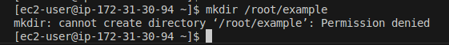
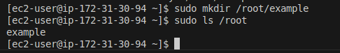
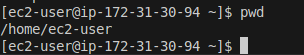
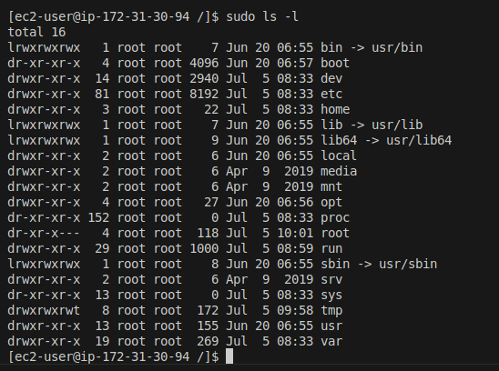
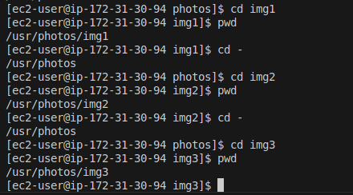
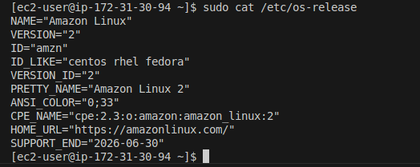
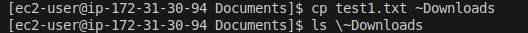
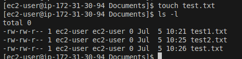
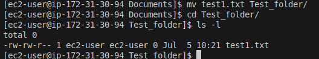

## Creating Directory without Sudo 

## Creating Directory with Sudo 

## Present Working Directory

## ls

Creating the Photos Directory 

## Navigating into the directories and showing the Pwd 

## Cating the OS release

## Copy 

## Touch

## MV 

